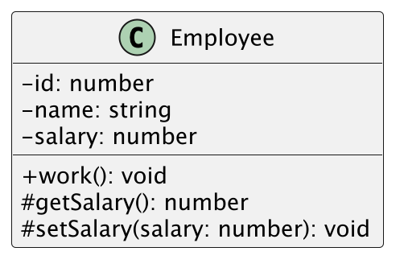
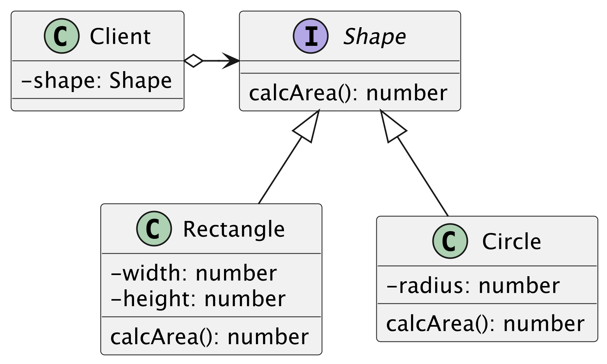

## 演習 1

次のクラス図を TypeScript で実装してください

メソッドの仕様

- work メソッドは"働きます"とログ出力します
- getSalary メソッドはフィールドの salary を返却します
- setSalary メソッドは引数の sarlary をフィールドの salary に代入します

## 演習 2

次のクラスを TypeScript で実装してください

メソッドの仕様

- Rectangle の面積は width と height の掛け算で算出します
- Circle の面積は radius _ radius _ Math.PI で算出します
